<div align="center">


# Flodo

A small floating to-do list for macOS, Linux, and Windows.

[](https://github.com/michellemayes/flodo/actions/workflows/ci.yml)
[](https://github.com/michellemayes/flodo/actions/workflows/release.yml)
[](LICENSE)


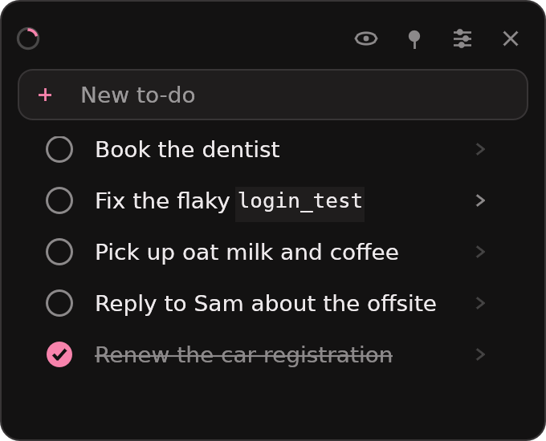

</div>

---

Flodo is a frameless panel that floats above your other windows. It holds one
list: add a to-do, check it off, and hide the completed ones when you want to.

It has no tags, priorities, due dates, projects, or sub-tasks, and is not
intended to grow them.

## What it does

| Area | Detail |
|---|---|
| Window | Frameless and always-on-top. Drag it by the title bar or anywhere that isn't a control; unpin it when it's in the way. |
| Bodies | A to-do is one line, but can carry a collapsible markdown description underneath, including fenced code snippets. <kbd>⌘</kbd><kbd>⏎</kbd> or the chevron opens one. |
| Appearance | Eight accent colours, light and dark, plus font, code font, text size, row spacing, and opacity. |
| Keyboard | The composer keeps focus after <kbd>Enter</kbd>, so several to-dos can be added without using the mouse. Every shortcut is listed in the settings sheet. |
| Quick capture | Double-tap <kbd>⇧</kbd> anywhere to summon Flodo and write down whatever text you had selected. Off by default; macOS only. |
| Undo | A delete is announced and offered back for a few seconds, or with <kbd>⌘</kbd><kbd>Z</kbd>. |
| Size | A single binary, around 8 MB. No webview, no background service, no account. |
| Storage | Two JSON files you can read, edit, and sync. |
| Scripting | A CLI over the same list, and an optional Claude skill for agents. |

## Install

Download the latest [release](../../releases).

**macOS** — unzip and drag `Flodo.app` to Applications. Released builds are
signed with a Developer ID and notarized by Apple, so they open on a
double-click. A bundle you built yourself is ad-hoc signed instead, and the
first launch needs right-click → **Open**, or:

```sh
xattr -dr com.apple.quarantine /Applications/Flodo.app
```

**Linux / Windows** — unpack the archive and run `flodo`.

**From source** — needs a stable Rust toolchain:

```sh
git clone https://github.com/michellemayes/flodo
cd flodo
cargo run --release
```

On macOS, build the bundle rather than keeping the bare binary — it is what
carries the icon, and what a released Flodo is:

```sh
./scripts/bundle-macos.sh      # → dist/Flodo.app
```

<details>
<summary>Linux build dependencies</summary>

```sh
sudo apt install libgtk-3-dev libxkbcommon-dev libgl1-mesa-dev \
                 libxcb-render0-dev libxcb-shape0-dev libxcb-xfixes0-dev
```
</details>

## Using it

Type in the box at the top and press <kbd>Enter</kbd>. The new to-do appears on
the line directly below, and the field keeps focus, so adding several in a row
is uninterrupted typing.

Click the circle to check something off. Completed to-dos stay in place, dimmed
and struck through, so the list doesn't reorder under the cursor. The eye in the
title bar hides them, and the mark in the top-left fills as the list gets done.

<div align="center">
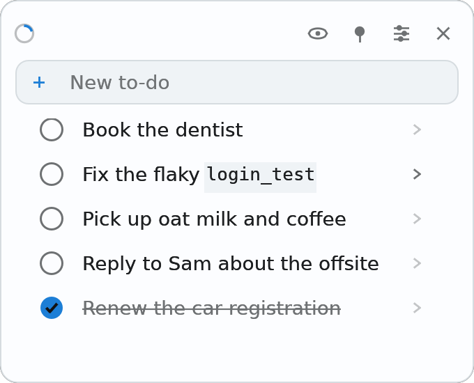
</div>

Rows light up under the cursor, which is where the drag handle and the delete
button appear. Deleting says so, and offers the to-do back for a few seconds:

<div align="center">
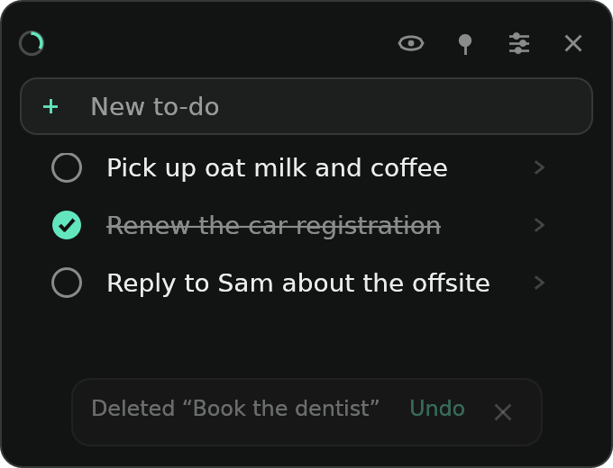
</div>

An empty list is the one place Flodo explains itself, and then never again:

<div align="center">
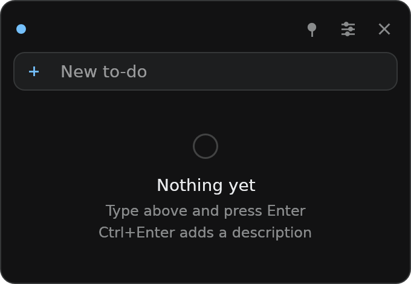
</div>

### Markdown

Titles and bodies are markdown. While you're typing you see the raw source;
click away and it renders. There is no formatting toolbar.

| While you're typing | After you click away |
|---|---|
| 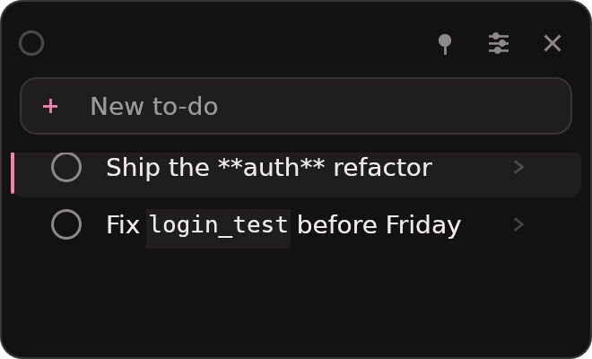 | 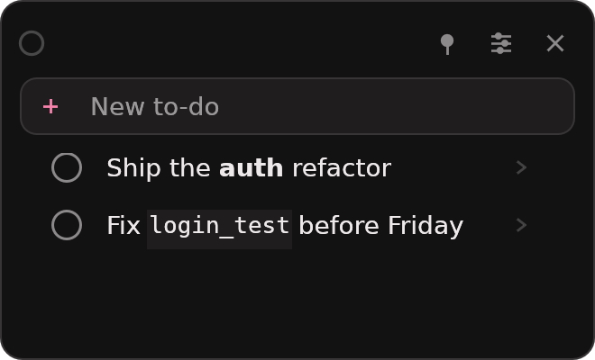 |

### Bodies

Every row has a chevron on the right; click it to open a body. It holds the
detail: a note, a link, a stack trace, a command.

Or never touch the mouse. <kbd>⌘</kbd><kbd>⏎</kbd> is the same thing from the
keyboard, and it means the same thing everywhere: in the composer it adds the
to-do and drops you into its body, in a title it moves down to the body, and in
a body it finishes and puts you back in the composer. A to-do with a note is
one uninterrupted run of typing.

<div align="center">
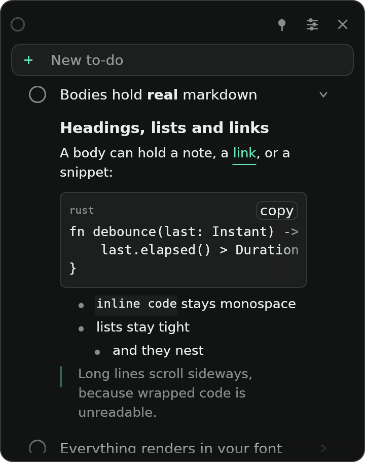
</div>

Bodies support headings, **bold**, *italic*, `inline code`, fenced code blocks
with a language label and a copy button, nested lists, links, blockquotes,
horizontal rules, and ~~strikethrough~~.

Code blocks scroll sideways rather than wrapping:

````markdown
Races on the session cookie. Reproduce with:

```sh
cargo test --test login -- --test-threads=1
```

- [the flaky run](https://ci.example.com/12345)
- probably the `SameSite` change
````

### Appearance

<div align="center">
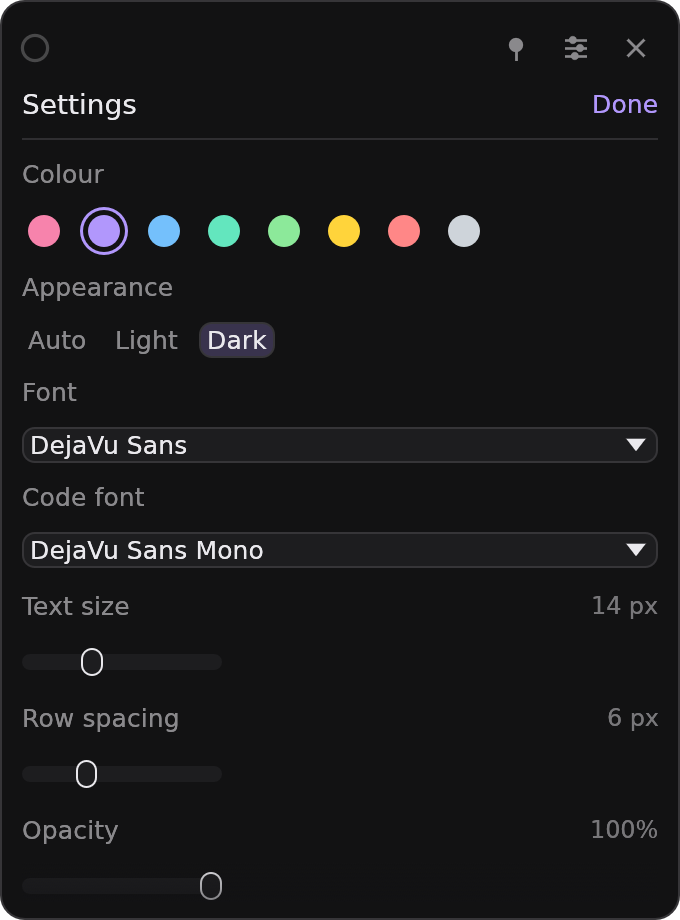
</div>

Seven settings on one screen, opened with <kbd>⌘</kbd><kbd>,</kbd>.

The accent colour tints the whole panel, not just the checkbox: background,
surfaces, and borders all shift toward its hue at low saturation.

| Pink · dark | Green · light | Amber · dark | Purple · light |
|---|---|---|---|
| 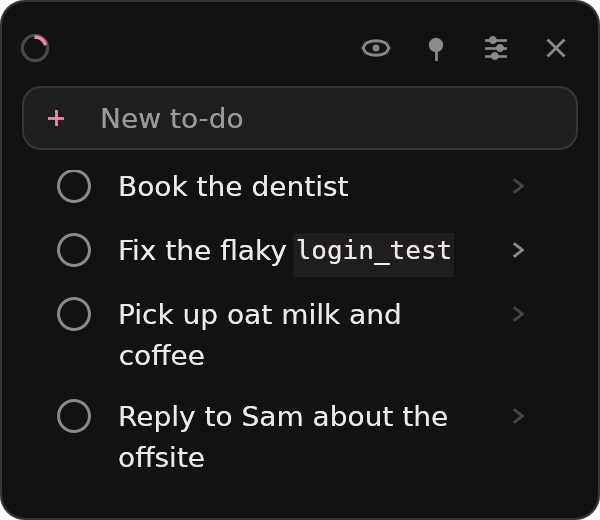 | 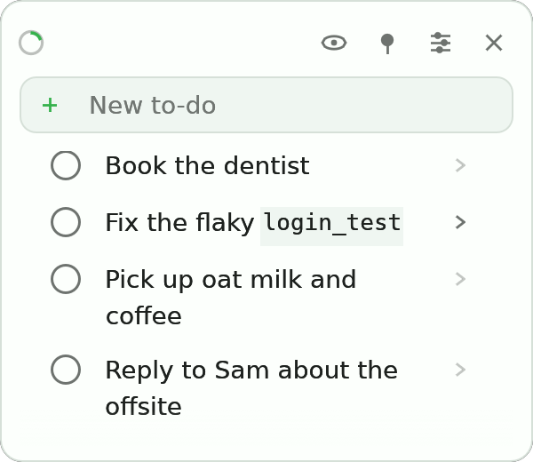 | 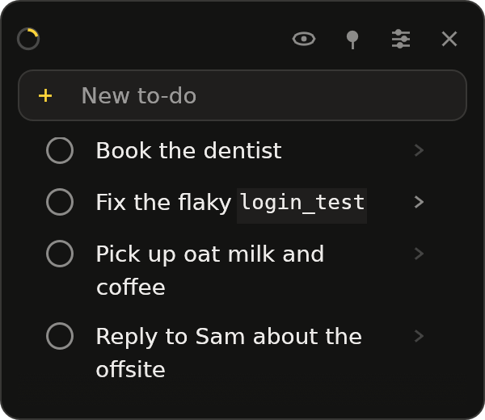 | 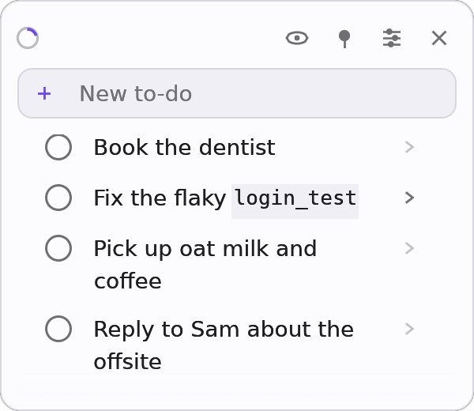 |

All eight accents are contrast-tested in both light and dark. A unit test
asserts WCAG AA for body text against the background.

## Keyboard

| Shortcut | Action |
|---|---|
| <kbd>Enter</kbd> | Add the to-do, keep focus for the next one |
| <kbd>⌘</kbd><kbd>⏎</kbd> | Add or edit the description, then come back |
| <kbd>⌘</kbd><kbd>N</kbd> | Jump to the composer |
| <kbd>⌘</kbd><kbd>E</kbd> | Show / hide completed |
| <kbd>⌘</kbd><kbd>P</kbd> | Pin / unpin from always-on-top |
| <kbd>⌘</kbd><kbd>,</kbd> | Settings |
| <kbd>⌘</kbd><kbd>Z</kbd> | Undo the last delete |
| <kbd>⌘</kbd><kbd>↑</kbd> / <kbd>⌘</kbd><kbd>↓</kbd> | Move the to-do you're editing |
| <kbd>⌘</kbd><kbd>⌫</kbd> | Delete |
| <kbd>Esc</kbd> | Stop editing, or close settings |
| <kbd>⌥</kbd><kbd>Space</kbd> | Summon or hide Flodo from anywhere |
| <kbd>⇧</kbd> <kbd>⇧</kbd> | Summon, and keep the selected text — off by default, see below |

Use <kbd>Ctrl</kbd> instead of <kbd>⌘</kbd> on Linux and Windows. Drag the
handle on the left of a row to reorder it.

The same list is at the bottom of the settings sheet, spelled for the platform
you are on, so it isn't something you have to come back here for:

<div align="center">
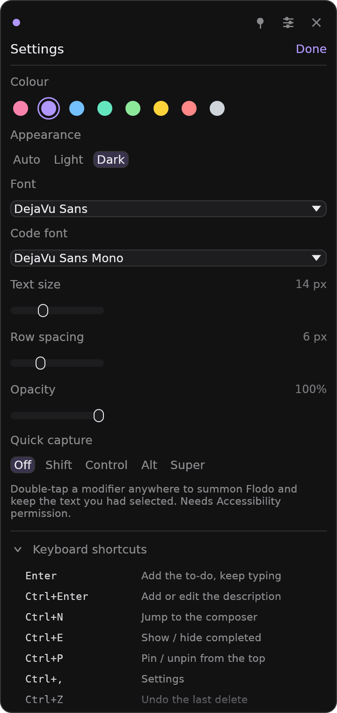
</div>

## Quick capture

<kbd>⌥</kbd><kbd>Space</kbd> brings Flodo forward from anywhere and works out
of the box. Quick capture is the same gesture without the chord, and it brings
something with it: **double-tap <kbd>⇧</kbd>** and Flodo comes forward with
whatever text you had selected already written down as a to-do.

Nothing selected? Then it is just a summon, with the cursor in the composer.

Turn it on under **Quick capture** in the settings sheet, where the same row
picks the modifier: <kbd>⇧</kbd>, <kbd>⌃</kbd>, <kbd>⌥</kbd>, or <kbd>⌘</kbd>.

### What it costs

It is the only part of Flodo that asks the system for anything, which is why
it is off until you switch it on:

- **Accessibility permission.** A bare <kbd>⇧</kbd> can't be registered as a
  shortcut the way <kbd>⌥</kbd><kbd>Space</kbd> can, so hearing one means a
  listen-only event tap; reading the selection means asking the focused app.
  macOS gates both. You will be prompted the first time you switch it on.
- **macOS only, for now.** X11, Wayland, and Windows each need a different
  answer, and Flodo would rather say so than half-answer it. The
  <kbd>⌥</kbd><kbd>Space</kbd> summon works everywhere, unchanged.

Two things it deliberately does not do. It never touches your clipboard —
reading the selection goes through the Accessibility API rather than a
synthetic <kbd>⌘</kbd><kbd>C</kbd>, so whatever you had copied stays copied.
And it only ever watches the one modifier you chose: the letters you type are
not inspected, and nothing is recorded.

### How the text lands

A one-line selection becomes the title. A longer one puts the first line in
the title and the rest in the description, and if that first line is itself
longer than a title should be, it is cut short in the row and kept whole in
the description — nothing selected is dropped. Very long selections stop at
2000 characters; this is a to-do list, not an archive.

### Tuning

The double-tap speed defaults to 400 ms and lives in `settings.json` rather
than the sheet, which is short on purpose:

```json
{
  "quick_capture": { "enabled": true, "key": "shift", "window_ms": 400 }
}
```

`key` is one of `shift`, `control`, `alt`, `command`; `window_ms` is clamped
to 150–900.

Some apps will not report a selection — a few Electron and Java apps, and
browsers until their own accessibility support is switched on. Those still
summon; they just arrive empty.

## Command line

The same binary is also a CLI over the same list, for scripts and coding
agents.

```console
$ flodo add Buy oat milk
7312124937646080

$ flodo add "Fix the flaky login_test" --body "Races on the session cookie."
7312124937695232

$ flodo list
- [ ] Fix the flaky login_test  (7312124937695232)
      Races on the session cookie.
- [ ] Buy oat milk  (7312124937646080)

$ flodo done 7312124937646080

$ flodo list --count
1
```

| Command | What it does |
|---|---|
| `flodo list` | Open to-dos as markdown checkboxes |
| `flodo list --json` | Machine-readable array |
| `flodo list --all` | Include completed |
| `flodo list --count` | Just the number |
| `flodo add <text> [--body <text>]` | Add one, print its id |
| `flodo done <id>...` | Mark complete |
| `flodo undone <id>...` | Mark not complete |
| `flodo rm <id>...` | Delete |

`--json` gives a stable record shape — internal fields never leak into it:

```json
[
  {
    "id": 7312124937695232,
    "title": "Fix the flaky `login_test`",
    "body": "Races on the session cookie.",
    "done": false,
    "created_at": 1785186752,
    "completed_at": null
  }
]
```

Writes are safe while the app is open: it polls the file and picks up outside
edits within a second, so it won't overwrite what the CLI wrote. Two further
guarantees:

- **Unknown ids change nothing.** `flodo done 1 2 999` with one bad id exits
  non-zero having applied none of them, rather than leaving the first two
  half-done.
- **A file that fails to parse is never written over.** The CLI exits non-zero
  instead of starting from an empty list and overwriting the real one.

## Claude skill

Optional, installed with one command. It documents the CLI for Claude:
fetching ids from `--json` before changing anything, and asking rather than
guessing when a title is ambiguous.

```sh
./scripts/install-skill.sh            # global: ~/.claude/skills/flodo
./scripts/install-skill.sh --project  # this repo only: ./.claude/skills/flodo
./scripts/install-skill.sh --link     # symlink, so it tracks the repo
./scripts/install-skill.sh --uninstall
```

Then just ask, in Claude Code or the Claude app:

> what's on my to-do list?
>
> add "renew the domain" to my list
>
> mark the dentist one done

The skill is a single file, [`skills/flodo/SKILL.md`](skills/flodo/SKILL.md),
so you can read what Claude is being told before installing it. Flodo does not
require it.

> [!NOTE]
> The skill runs `flodo`, so the binary needs to be on your `PATH`
> (`cargo install --path .` does that). The installer warns you if it isn't.

## Your data

| Platform | Location |
|---|---|
| macOS | `~/Library/Application Support/Flodo/` |
| Linux | `~/.local/share/flodo/` |
| Windows | `%APPDATA%\Flodo\` |

Two plain JSON files. `todos.json` looks like this:

```json
{
  "version": 1,
  "todos": [
    {
      "id": 7318429184000,
      "title": "Fix the flaky `login_test`",
      "body": "Races on the session cookie.",
      "done": false,
      "created_at": 1785192000,
      "expanded": false
    }
  ]
}
```

It is an ordinary file: edit it by hand, keep it in a git repo, or sync it.
`FLODO_STATE_DIR` points Flodo somewhere else.

Three properties protect it:

- Saves are **atomic**: written to a temp file and renamed into place, so a
  crash mid-write cannot leave a partial list.
- A file that fails to parse is **quarantined**, never overwritten. The
  original bytes are kept as `todos.json.corrupt-<timestamp>`, and the app
  shows a notice.
- Unknown fields **round-trip**, so an older build will not strip fields a
  newer one wrote.

## Known limitations

- **Emoji render in monochrome.** epaint has no COLR/sbix path, so Apple Color
  Emoji falls back to a bundled monochrome font.
- **Bold and italic need real font faces.** egui has no synthetic emphasis.
  Flodo uses a family's real bold/italic/oblique faces, and can instance a
  variable `wght` or `slnt` axis where one exists (this covers SF Pro and
  Inter). A family with no bold face renders `**bold**` as regular.
- **Text editing is egui's, not the system's** — no spellcheck, no emoji picker,
  no dictation, and only partial IME support.
- **Flodo appears in the Dock and in ⌘-Tab.** A menu-bar-only accessory mode is
  a plausible future change, not a current one.
- **Quick capture is macOS-only**, and macOS grants its permission to a
  *signature*, not a path — so a bare `cargo run` binary and `Flodo.app` are
  two different applications as far as System Settings is concerned, and
  replacing the binary can mean granting it again.

## Development

```sh
cargo test                                                  # 123 tests
cargo clippy --all-targets --all-features -- -D warnings
cargo fmt --all -- --check
```

Tests cover what can be checked without a screen: the model, atomic writes and
corruption handling, settings clamping, the markdown parser (including a
no-panic sweep over pathological input), CLI argument parsing and output shape,
hotkey parsing, font validation, palette contrast, and the icon rasteriser and
its PNG output.

Quick capture is split so that most of it is testable the same way: the
double-tap state machine and the selection-to-to-do split are pure functions
in `src/capture/mod.rs`, unit tested on every platform, while
`src/capture/macos.rs` is only the binding that feeds them. The tests are the
place to check that typing a capital letter isn't a double-tap.

The GUI is checked by screenshot. `eframe` has a built-in hook that renders a
couple of frames, writes a PNG, and exits, so nothing beyond Xvfb is needed:

```sh
xvfb-run -a -s "-screen 0 700x900x24" \
  env LIBGL_ALWAYS_SOFTWARE=1 GALLIUM_DRIVER=llvmpipe \
      FLODO_STATE_DIR=/tmp/flodo-shots \
      FLODO_DEMO=showcase \
      EFRAME_SCREENSHOT_TO=/tmp/flodo.png \
  cargo run --features screenshot
```

`FLODO_DEMO` seeds a scenario in memory without touching the real list:
`hero`, `showcase`, `editing`, `rendered`, `settings`, `empty`, `long`, `body`.

Every screenshot in this README is produced that way, and
`scripts/screenshots.sh` regenerates all of them. It writes a settings file per
shot, so the window size, accent and light/dark are pinned rather than
inherited from whoever ran it last, and the output is byte-for-byte
reproducible.

```sh
./scripts/screenshots.sh              # all of them
./scripts/screenshots.sh hero light   # just these
```

> [!NOTE]
> The build uses the glow backend rather than wgpu. eframe's screenshot hook is
> glow-only, and wgpu needs a Vulkan or GLES adapter that headless CI often
> lacks, so switching backends would cost this screenshot workflow.

### The icon

`src/icon.rs` draws the icon rather than loading one: distance fields for the
rounded square and the check mark, supersampled, plus a small PNG writer. The
window icon, the `.icns` in the bundle, and the image at the top of this file
all come out of it, and each size is rasterised at its own resolution instead
of being scaled down from one bitmap, which is what keeps the 16px version
legible.

```sh
flodo icon /tmp            # /tmp/Flodo.iconset, ready for iconutil
```

Its PNGs store pixels uncompressed — a few lines instead of a deflate
implementation — so `bundle-macos.sh` runs each one through `sips` on the way
into the `.icns`. The image at the top of this file is the 128px member, put
through the same pass:

```sh
sips -s format png /tmp/Flodo.iconset/icon_128x128.png --out docs/images/icon.png
```

### macOS bundling

`scripts/bundle-macos.sh` builds `dist/Flodo.app`: the binary (optionally
universal), the icon, `macos/Info.plist` with the version stamped in, and a
signature. Set `APPLE_SIGNING_IDENTITY` to sign with a Developer ID — with the
hardened runtime and a secure timestamp, both of which Apple requires and
neither of which can be added afterwards — and it falls back to an ad-hoc
signature when that variable is unset, so a build without a paid account still
works.

`scripts/notarize-macos.sh` then sends the bundle to Apple and staples the
ticket to it, which is what removes the right-click → Open step. It needs
`APPLE_ID`, an app-specific password in `APPLE_PASSWORD`, and `APPLE_TEAM_ID`.
Staple before archiving: the ticket lives inside the `.app`.

`macos/Info.plist` is also linked into the binary's `__TEXT,__info_plist`
section by `build.rs`. An executable outside an `.app` has no `Info.plist`, and
a macOS process without one is treated as not Retina-capable — it renders at 1x
and is scaled up, which is why a plain `cargo run` build used to look soft.
Embedding the plist gives the loose binary the same bundle dictionary the app
has.

### Releasing

Push a semver tag:

```sh
git tag -a v0.1.0 -m "Flodo v0.1.0"
git push origin v0.1.0
```

The leading `v` is optional; `0.1.0` triggers the same workflow. A release can
also be built from the Actions tab (Release → Run workflow) by entering an
existing tag.

This builds a universal macOS `.app` (arm64 + x86_64) plus Linux and Windows
archives, and publishes them to a GitHub Release with `SHA256SUMS.txt`. Tags
containing a hyphen, such as `v0.1.0-rc.1`, publish as pre-releases.

The macOS build is signed and notarized when these repository secrets exist,
and falls back to an ad-hoc signature when they do not — a fork can still cut a
release, and the install instructions on the release say which kind it is:

| Secret | What it is |
| --- | --- |
| `APPLE_SIGNING_IDENTITY` | The certificate's full name, e.g. `Developer ID Application: Your Name (TEAMID)` |
| `APPLE_CERTIFICATE` | The Developer ID Application `.p12`, base64-encoded (`base64 -i cert.p12 \| pbcopy`) |
| `APPLE_CERTIFICATE_PASSWORD` | The password set when exporting that `.p12` |
| `APPLE_ID` | The Apple account the certificate belongs to |
| `APPLE_PASSWORD` | An app-specific password for that account, **not** the account password |
| `APPLE_TEAM_ID` | The ten-character team identifier |

Only `APPLE_SIGNING_IDENTITY` is tested for; set it last, so a half-configured
repository keeps producing ad-hoc builds instead of failing a release.

## Built with

[egui](https://github.com/emilk/egui) ·
[eframe](https://github.com/emilk/egui/tree/master/crates/eframe) ·
[pulldown-cmark](https://github.com/raphlinus/pulldown-cmark) ·
[fontdb](https://github.com/RazrFalcon/fontdb) ·
[skrifa](https://github.com/googlefonts/fontations) ·
[global-hotkey](https://github.com/tauri-apps/global-hotkey) ·
[serde](https://serde.rs)

## License

[MIT](LICENSE)
