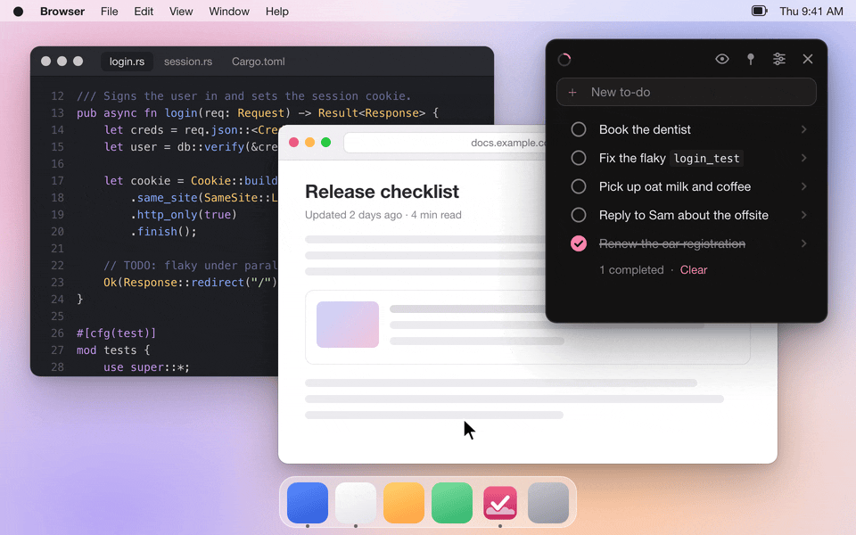
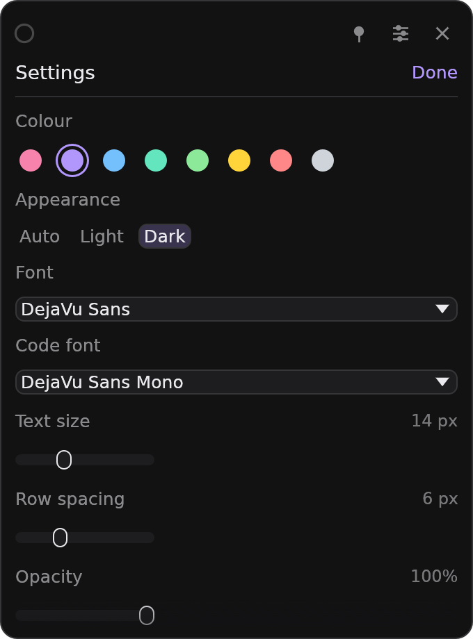
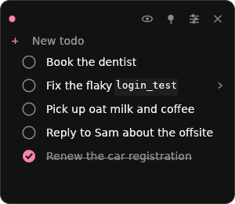
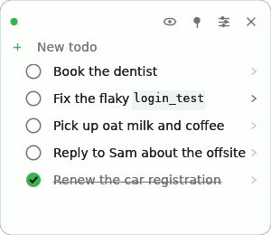
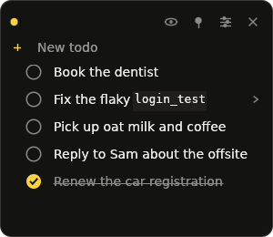
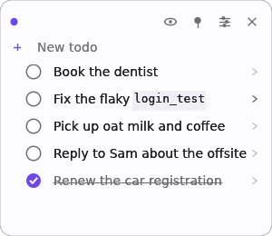

<div align="center">


# Flodo

A small floating to-do list for macOS, Linux, and Windows.

[](https://github.com/michellemayes/flodo/actions/workflows/ci.yml)
[](https://github.com/michellemayes/flodo/actions/workflows/release.yml)
[](LICENSE)



</div>

Flodo is one list in a frameless panel that stays above your other windows.
Type a to-do, press <kbd>Enter</kbd>, click to check it off. No tags,
priorities, due dates, or projects — and it isn't meant to grow them.

- **Always on top.** Drag it anywhere; unpin it with <kbd>⌘</kbd><kbd>P</kbd> when it's in the way.
- **Keyboard first.** The composer keeps focus, so several to-dos are just typing. <kbd>⌥</kbd><kbd>Space</kbd> summons it from anywhere.
- **Paste a list** of bullets, numbers, or `- [ ]` checkboxes and every line becomes a to-do.
- **Markdown** in titles, and an optional description under each to-do for notes, links, and code.
- **Undo everything** with <kbd>⌘</kbd><kbd>Z</kbd>: deletes, check-offs, clears, pastes.
- **Small and local.** One ~8 MB binary, no account, and your list is a plain JSON file.
- **Scriptable** through a CLI over the same list, plus an optional Claude skill.
- **Updates itself** when you say so: a banner offers each new release.

## Install

Download the latest [release](../../releases).

- **macOS** — unzip and drag `Flodo.app` to Applications.
- **Linux / Windows** — unpack the archive and run `flodo`.

Or build from source with a stable Rust toolchain:

```sh
git clone https://github.com/michellemayes/flodo
cd flodo
cargo run --release              # or ./scripts/bundle-macos.sh for Flodo.app
```

<details>
<summary>Linux build dependencies</summary>

```sh
sudo apt install libgtk-3-dev libxkbcommon-dev libgl1-mesa-dev \
                 libxcb-render0-dev libxcb-shape0-dev libxcb-xfixes0-dev
```
</details>

Flodo checks for a new release at launch and once a day. When there is one, a
banner offers it. Click **Update** and Flodo downloads it, checks its SHA-256,
swaps it in, and restarts. Nothing installs until you click. Turn the check
off in settings, or use `flodo update` from a terminal. On macOS, keep
`Flodo.app` somewhere you can write to, such as Applications. A copy that
can't replace itself offers the download page instead.

## Keyboard

| Shortcut | Action |
|---|---|
| <kbd>Enter</kbd> | Add the to-do, or edit the selected one |
| <kbd>⌘</kbd><kbd>⏎</kbd> | Add or edit the description |
| <kbd>↑</kbd> / <kbd>↓</kbd> | Walk the list |
| <kbd>Space</kbd> | Check off the selected to-do |
| <kbd>⌫</kbd> | Delete the selected to-do |
| <kbd>⌘</kbd><kbd>↑</kbd> / <kbd>⌘</kbd><kbd>↓</kbd> | Move it |
| <kbd>⌘</kbd><kbd>E</kbd> | Show / hide completed |
| <kbd>⌘</kbd><kbd>⇧</kbd><kbd>⌫</kbd> | Clear completed |
| <kbd>⌘</kbd><kbd>P</kbd> | Pin / unpin from always-on-top |
| <kbd>⌘</kbd><kbd>Z</kbd> | Undo |
| <kbd>⌘</kbd><kbd>,</kbd> | Settings |
| <kbd>⌥</kbd><kbd>Space</kbd> | Summon or hide Flodo from anywhere |

Use <kbd>Ctrl</kbd> instead of <kbd>⌘</kbd> on Linux and Windows. The full
list is also at the bottom of the settings sheet.

## Make it yours

<div align="center">

</div>

Eight accent colours in light and dark, plus font, code font, text size, row
spacing, and opacity. The accent tints the whole panel, and every combination
is contrast-tested for WCAG AA.

| Pink · dark | Green · light | Amber · dark | Purple · light |
|---|---|---|---|
|  |  |  |  |

## Quick capture (macOS)

Double-tap <kbd>⇧</kbd> anywhere and Flodo comes forward with whatever text you
had selected already written down as a to-do. It's off by default — turn it on
under **Quick capture** in settings, which also picks the modifier key.

It needs Accessibility permission to hear the key and read the selection. It
never touches your clipboard and only watches the one modifier you chose.

## Command line

The same binary is a CLI over the same list, for scripts and coding agents:

```console
$ flodo add "Fix the flaky login_test" --body "Races on the session cookie."
7312124937695232
$ flodo list
- [ ] Fix the flaky login_test  (7312124937695232)
      Races on the session cookie.
$ flodo done 7312124937695232
```

`flodo list` takes `--json`, `--all`, and `--count`; `undone` and `rm` round
it out, and `flodo update [--check]` installs or reports a new release. It's safe to use while the app is open — the app picks up outside
edits within a second.

To let Claude manage your list, install the skill:

```sh
./scripts/install-skill.sh
```

Then ask things like *"what's on my to-do list?"* or *"mark the dentist one
done"*. The skill is a single readable file,
[`skills/flodo/SKILL.md`](skills/flodo/SKILL.md), and needs `flodo` on your
`PATH` (`cargo install --path .`).

## Your data

Two plain JSON files you can read, edit, or sync:

| Platform | Location |
|---|---|
| macOS | `~/Library/Application Support/Flodo/` |
| Linux | `~/.local/share/flodo/` |
| Windows | `%APPDATA%\Flodo\` |

Saves are atomic, and a file that fails to parse is set aside rather than
overwritten. `FLODO_STATE_DIR` points Flodo somewhere else.

## Known limitations

- Emoji render in monochrome.
- Text editing is egui's, not the system's: no spellcheck or dictation, and
  only partial IME support.
- Flodo appears in the Dock and in ⌘-Tab.

## Development

```sh
cargo test
cargo clippy --all-targets --all-features -- -D warnings
cargo fmt --all -- --check
```

The screenshots come from `./scripts/screenshots.sh`, and the demo GIF from
`python3 scripts/demo/render.py`. Every merge to `main` that passes CI is
released automatically, as a patch bump. For a minor or major release, label
the PR `release:minor` or `release:major`, or put `[minor]` or `[major]` in a
commit message.

## License

[MIT](LICENSE)
